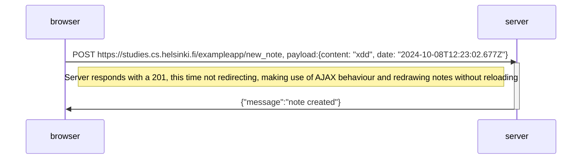

```mermaid
sequenceDiagram
    participant browser
    participant server

    browser->>server: POST https://studies.cs.helsinki.fi/exampleapp/new_note, payload:{content: "xdd", date: "2024-10-08T12:23:02.677Z"}
    activate server
    Note right of browser: Server responds with a 201, this time not redirecting, making use of AJAX behaviour and redrawing notes without reloading
    server->>browser: {"message":"note created"}
    deactivate server

    
```